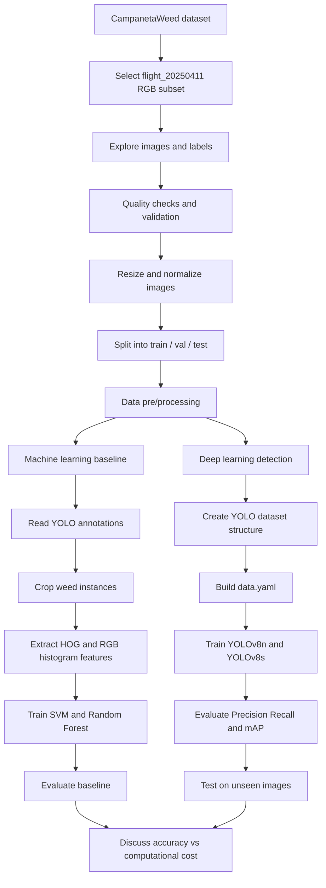

# Deep Learning Models for Weed Species Detection from UAV Images

The project is based on the **CampanetaWeed** dataset and focuses on the **`flight_20250411`** subset using **RGB images only**.

---

## Project Summary

Weed infestation reduces crop productivity by competing with crops for water, nutrients, and sunlight. In orchards, uniform herbicide spraying is still widely used, but it increases chemical usage, cost, and environmental impact. This project explores whether computer vision can support more precise weed detection from UAV imagery.

Two modelling approaches were used:

- **Classical machine learning baseline** based on handcrafted features
- **Deep learning object detection** using YOLOv8

The complete pipeline covers:

1. dataset exploration
2. data verification and preprocessing
3. data augmentation
4. machine learning baseline
5. deep learning training and evaluation
6. Discussion
7. Conclusion

> Note: due to the number of pages regulation anounced by the teacher, much of the detailed **machine learning baseline section** and several supporting figures were moved to the **appendix**.

---

## Dataset

The project uses the **CampanetaWeed** dataset, a UAV-based orchard weed dataset collected in **Corbera, Valencia, Spain** using a **DJI Mavic 3 Multispectral** drone. The original dataset includes RGB and multispectral imagery, but this project uses only the RGB data.

### Subset used

- `flight_20250411`

### Reported dataset checks

- **Missing labels:** 0
- **Empty label files:** 17
- **Corrupted images:** 0
- **Invalid bounding boxes:** 0

### Data split

The YOLO-ready dataset was split into:

- **70% training**
- **15% validation**
- **15% test**

### Why RGB only?

RGB imagery was selected to simplify preprocessing and to remain compatible with standard pretrained computer vision and object detection models.

---

## Project Structure

```text
.
├── 20250411/
├── dataset/
├── runs/
├── data.yaml
├── Notebook_1_Dataset_Exploration_and_Preparation.ipynb
├── Notebook_2_Machine_Learning_Baseline.ipynb
├── Notebook_3_Deep_Learning_Model_(YOLOv8).ipynb
├── yolov8n.pt
├── yolov8s.pt
├── Report.pdf
├── README.pdf
├── README.md
└── Presentation.pdf
```

---

## Source Files

The project is based on the following notebooks:

- `Notebook_1_Dataset_Exploration_and_Preparation.ipynb`
- `Notebook_2_Machine_Learning_Baseline.ipynb`
- `Notebook_3_Deep_Learning_Model_(YOLOv8).ipynb`

---

## How to Run the Code

To reproduce the project, run the notebooks in the same order as shown above.
Basically, we only need the 3 notebooks and the dataset 20250411. The rest will be created by the executed code

```bash
git clone https://github.com/Ushindi-Trj/CS4020-USN-spring-2026
cd CS4020-USN-spring-2026
```

---
## Workflow



---

## Methodology

### 1. Dataset exploration and preparation

The first notebook handles:

- loading RGB images and YOLO annotation files
- visual inspection of images and bounding boxes
- dataset statistics and class distribution analysis
- checking missing labels, empty labels, and corrupted images
- resizing images to **640 × 640**
- pixel normalization to **[0, 1]**
- verifying YOLO annotation format
- creating train/validation/test splits
- reorganizing the data into a YOLO-compatible structure

### 2. Data augmentation

To improve generalization, the we apply two augmentation techniques:

- **horizontal flipping**
- **random brightness and contrast adjustment**

Albumentations is used so that bounding boxes remain consistent after transformation.

### 3. Machine learning baseline

Before using deep learning, we build a classical baseline from cropped weed instances.

Main steps:

- read YOLO annotations
- convert normalized boxes to pixel coordinates
- crop weed regions from the original images
- resize crops to **64 × 64**
- extract handcrafted features:
  - **HOG (Histogram of Oriented Gradients)**
  - **RGB color histograms**
- train:
  - **SVM**
  - **Random Forest**
- evaluate classification performance

The **SVM** model performed better than the **Random Forest** baseline.

### 4. Deep learning approach

The deep learning stage uses two YOLOv8 variants:

- **YOLOv8n**
- **YOLOv8s**

### 5. Training setup

#### Initial configuration

- **Epochs:** 10
- **Image size:** 416 × 416
- **Batch size:** 8

#### Tuned configuration

- **Epochs:** 50
- **Image size:** 640 × 640
- **Batch size:** 16

### 6. Evaluation metrics

The models are evaluated using:

- **Precision**
- **Recall**
- **mAP@0.5**
- **mAP@0.5:0.95**

For the classical baseline, accuracy, precision, recall, and F1-score are discussed in the report appendix.

---

## Main Results

### Initial YOLO comparison

| Model | Precision | Recall | mAP@0.5 | mAP@0.5:0.95 |
|---|---:|---:|---:|---:|
| YOLOv8n | 0.5590 | 0.0360 | 0.0300 | 0.0096 |
| YOLOv8s | 0.0031 | 0.0350 | 0.0023 | 0.00068 |

### YOLOv8n after tuning

| Batch | Time | Image size | Precision | Recall | mAP@0.5 | mAP@0.5:0.95 |
|---|---|---:|---:|---:|---:|---:|
| 8 | 26 min | 416 | 0.5590 | 0.0360 | 0.0300 | 0.0096 |
| 16 | 179 min | 640 | 0.1050 | 0.1180 | 0.0822 | 0.0326 |

### YOLOv8s after tuning

| Batch | Time | Image size | Precision | Recall | mAP@0.5 | mAP@0.5:0.95 |
|---|---|---:|---:|---:|---:|---:|
| 8 | 48 min | 416 | 0.0031 | 0.0350 | 0.0023 | 0.00068 |
| 16 | 377 min | 640 | 0.0415 | 0.1350 | 0.0413 | 0.0142 |

### Key observations

- Under the default setting, **YOLOv8n outperformed YOLOv8s**.
- After tuning, **both models improved**.
- **YOLOv8s improved more strongly** when the training configuration was strengthened.
- **YOLOv8n remained more computationally efficient**.
- **deep learning is more suitable than the traditional ML handcrafted-feature approach** for weed detection.

---

## Technologies

### Programming and environment

- Python
- Jupyter Notebook / Google Colab style workflow
- Overleaf for report writing

### Data handling and preprocessing

- NumPy
- Pandas
- OpenCV (`cv2`)
- Pillow (`PIL`)
- os / shutil / pathlib

### Visualization

- Matplotlib
- Seaborn

### Data augmentation

- Albumentations

### Machine learning

- scikit-learn
  - Support Vector Machine (SVM)
  - Random Forest
  - train/test split utilities
  - evaluation metrics

### Deep learning and object detection

- PyTorch
- Ultralytics YOLOv8

---

## Challenges and Limitations

This project faced several practical challenges:

- strong class imbalance
- small weed objects in UAV imagery
- complex orchard background
- sensitivity to training configuration
- significantly higher compute cost after tuning
- only RGB data was used although the original dataset also provides multispectral bands

---

### Project report

**Ushindi, Don du vin & Sanati Houtki, Somayeh**  
*Deep Learning Models for Weed Species Detection from UAV Images*  
University of South-Eastern Norway (USN), 2026

### Dataset paper

**Salcedo-Navarro, A., Montalban-Faet, G., Garcia-Pineda, M., & Segura-Garcia, J.**  
*Dataset for weed detection in fruit orchards*  
Data in Brief, 63, 112276, 2025